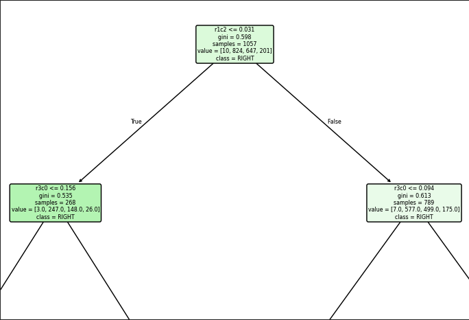

 Last time time I logged my 2048 games and picked the best ones for the training of the model. In last blog I also wrote that the game's log data is suitable for a traditional machine learning model whereas a deep learning model is in general better for unstructured data like language interpretation. The training of the model was relatively fast and simple. A Copilot agent generated the first version of a python script. Besides the training I will also explain the model's principles in this blog post and how it is derived from the game data. If you find any discrepancies in my text please add a comment. Honestly, I am still learning so feedback is welcome.  

You will find the ```train_offline.py``` script in 2048 repo's root. There are 3 major steps in the process:
- load logged json-files from ```training_data``` folder
- prepare data for training: calculate normalized values for decision trees
- feed the data to the model, the training part

At the end of the process the model is saved to a pickle ```.pkl```-file.

Each row in the training log pairs a board state with the actual move the player made next. From the row data and the move each tree learns which kind of move corresponds to the actual state of tiles on the board.
The training method for this experiment is so called "Supervised Learning" where the model learns to map the recorded board states to the actions logged. As my agent puts it:
> "There's no reinforcement loop or environment interaction happening." 


When the model was created with these above steps, I could have continued to next stage with my experiment, but I wanted to explore the model and created a visualization script ```load_2048_pkl.py``` which is in visualize folder. It will load the pkl-file and create 3 images of the model.


In the above image is one decision tree that has the ability to predict the next move. 
A decision tree is a characteristic for Random Forest (RF) model. 

Each decision tree starts from a tile from the board (node on the top) and split decisions (true/false) guide the path down to leaves which mark the end of a decision process. Split decisions are done based on the normalized value of the tile. 



The normalized tile value of r1c2 tile 0.031 gives a recovered tile value limit of 1.41 which means that definitive split value of tile is between 0 and 2. So the split question here is: is this tile empty (less than 0.031) or is it more than that (contains at least 2)

The node splits are followed down to a leaf. This leaf's move value is the selected move.

The model was trained with a parameter of 100 trees which means that each game situation has a calculation of 100 predictions for the next move. Each tree votes for a move (UP, DOWN, LEFT, RIGHT), and the move with the most votes wins. RF is described of an "ensemble" model because it takes multiple viewpoints (trees) to one situation.

Next step will be to execute the game with this model. In next blog post you can read how did the model perform and was it better than me.


