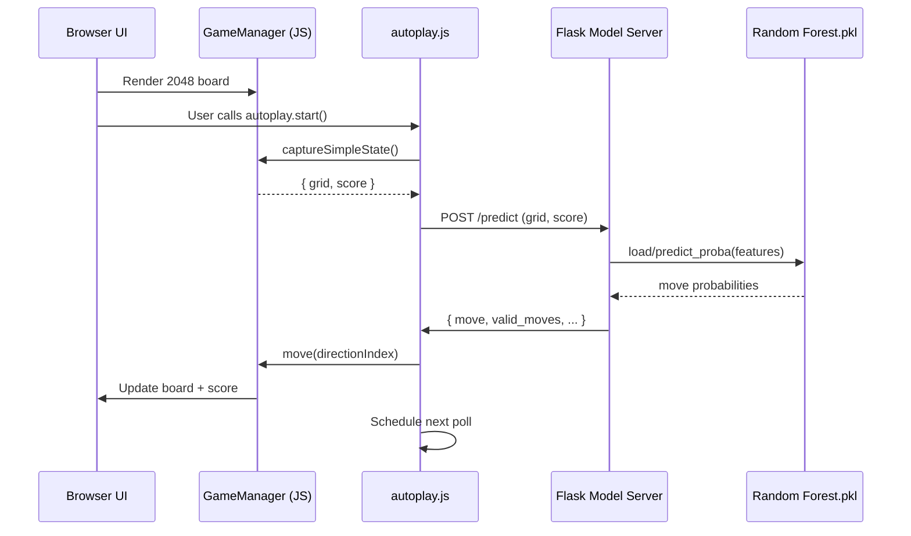

In last blog I trained the model with logs from my own game sessions. In this blog we will implement a server and an autoplay script for playing the game with the model. Soon you will discover how does the model perform: did it beat my score?

<script src="https://cdn.jsdelivr.net/npm/mermaid@10/dist/mermaid.min.js"></script>
<script>mermaid.initialize({ startOnLoad: true });</script>


````