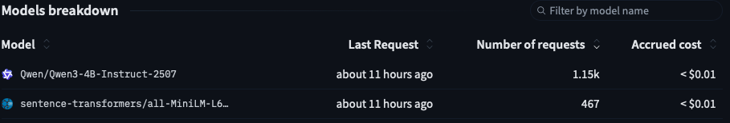

The first version of the bot had only 66 question-answer pairs. In this second step, I scaled the bot’s data so it’s more useful for testing flows. My plan was to generate hundreds more questions, but I found an [e-commerce dataset on Hugging Face](https://huggingface.co/datasets/bitext/Bitext-customer-support-llm-chatbot-training-dataset) with about 26k question-answer pairs. The data is in a CSV file, so the bot code was adapted to load data from CSV. The data is still persisted in a file, as in the first version.


Although there were plenty of FAQs in the dataset, some topics were still not covered. So I created a generation script, `generate_faqs.py`, which takes example questions as seeds for new questions. The data is generated with `Qwen/Qwen3-4B-Instruct-2507`, called using `huggingface_hub`'s `InferenceClient`. A Hugging Face token is required to use the inference client, and some credits too :). It cost less than one cent for inference and less than one cent to create embeddings.



The call to generate FAQs:
```bash
$ .venv/bin/python -m support_bot.helpers.generate_faqs --seed-file ./data/additional_questions.txt --num-questions 200 --question-model Qwen/Qwen3-4B-Instruct-2507 --answer-model Qwen/Qwen3-4B-Instruct-2507 --persist
```

The script generated 27 out of 200 requested questions because it removes near-duplicates using embedding similarity (threshold 0.85). `data_loader.py` is also much simpler now. The seed questions are in the repo: `additional_questions.txt`. The goal for this support bot isn’t perfect responses. It’s to create enough realistic variation to test retrieval quality, duplicate filtering, and edge cases. You can skip data generation, as it’s optional and not required for the following steps.

The support bot repo is [palapiessa/support-bot-sample](https://github.com/palapiessa/support-bot-sample), and the generator script is [support-bot-sample/src/support_bot/helpers/generate_faqs.py](support-bot-sample/src/support_bot/helpers/generate_faqs.py). Run the bot from the support bot root folder:
```bash
$ PYTHONPATH=src .venv/bin/python -m support_bot.cli
```

Try the support bot locally. Does it meet your expectations? We’ll start testing it in the next post. Keep reading!

## Disclaimer
This post and sample code are for educational purposes.
They are provided "as is" without warranties, and you should validate suitability, safety, and security before production use.
