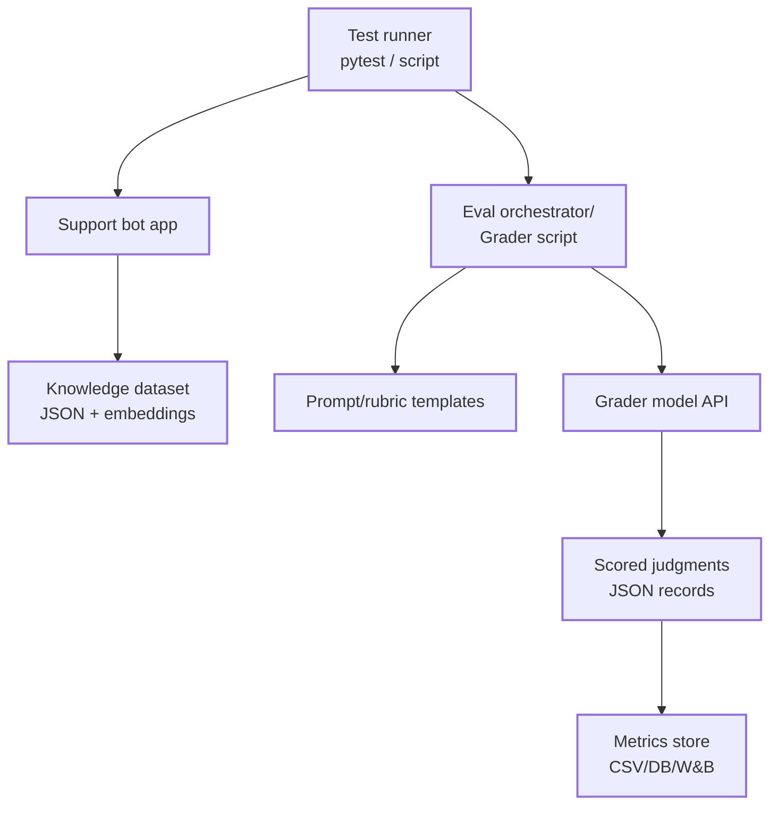

After all the preparation for a support bot, it is finally time to start testing. I had a hunch that the bot was not yet ready for production, and I hoped this test stage would reveal the reality. A test run is conducted with a script that takes a list of sample questions. These questions are sent to the bot, and the answers are saved. Then an LLM grader is called to evaluate the answers based on various factors:
- semantic_correctness
- helpfulness
- tone_safety
  
The answers are scored on the above factors using a 0-5 scale. If semantic_correctness >= 4 and tone_safety >= 4, the answer is marked as passed; otherwise, it fails. Below is a diagram of the evaluation steps.

Steps to grade the answers:
- get answers: run_eval_dataset.py
- score the answers: run_grader.py

```bash
$ cd grader
$ PYTHONPATH=src .venv/bin/python -m grader.run_eval_dataset --input-csv llm_eval_questions.csv --output-csv src/grader/data/llm_eval_answers.csv
$ ../.venv/bin/python ./src/run_grader.py --answers-csv ./data/llm_eval_answers.csv --output-jsonl ./data/llm_eval_scores.sample.jsonl
```


## LLM eval-suite workflow

<div class="mermaid">
flowchart TB
	A[A sample of 50 questions] --> B[Run support bot<br/>end-to-end query]
	B --> C[Capture bot answers]
	C --> D[Prepare a LLM grader to evaluate answers]
	D --> E[Call LLM grader<br/>structured JSON scoring]
	E --> F[Aggregate metrics<br/>quality/helpfulness/tone/safety/pass/fail]
	F --> G[Save first JSON score as baseline]
	G --> H[Visualize result]

	classDef readable font-size:16px,stroke-width:2px;
	class A,B,C,D,E,F,G,H readable;
</div>

## Test results

Let's look at the test results. The most obvious result in the diagram below is the high number of failed answers: about 35 out of 50. The grader was instructed to evaluate answers strictly, so some failures were due to nuances that were not acceptable. In many of these failed cases, a suitable answer was not found, and the fallback response was returned: *I am still learning and cannot answer that right now.* That is not the kind of answer I would like to receive when I am asking questions seriously.


Overall, testing with an LLM grader works, which is good news. We now have 50 test questions that can be reused for later testing and a baseline result for comparison. A subset of those 50 questions should still be used for manual testing as a guardrail. Around 12-20 questions should be executed and evaluated manually, then compared with LLM grader results to confirm that the grader is still working reliably.

Command to create result diagram: visualize_scores.py
```bash
$ cd project_root
$ ./.venv/bin/python ./grader/src/visualize_scores.py --input-jsonl ./grader/data/llm_eval.core_baseline_v1.jsonl --output-png ./grader/data/llm_eval_baseline_v1.png
```

In the next blog post, I'll send the test results to Azure for application telemetry and result monitoring. Keep reading!

## LLM eval-suite architecture

The evaluation architecture has two main parts: the support bot and the grader.
The support bot is built on a knowledge dataset and precomputed embeddings of the dataset questions. When a test question is sent to the bot, it retrieves the most relevant answer from this indexed knowledge base.
A runner script orchestrates the workflow end to end: it executes the support bot for each test question, captures the bot’s answers, and then sends the question-answer pairs to the grader.
The grader uses an LLM to evaluate each bot answer against the defined rubric (for example, semantic correctness, helpfulness, and tone/safety), produces structured scores, and stores the results for metrics, visualization, and baseline comparison.




## Disclaimer
This post and sample code are for educational purposes.
They are provided "as is" without warranties, and you should validate suitability, safety, and security before production use.
